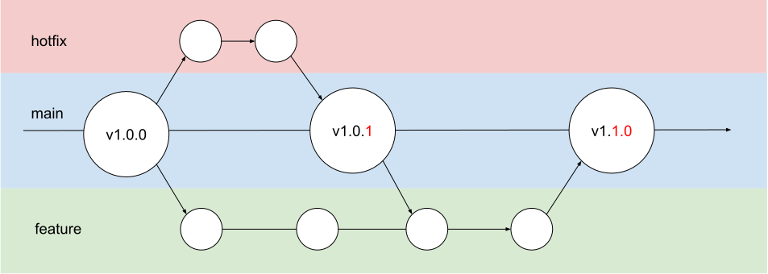

# GitHub リポジトリのルール

## GitHub Flow を元にしたブランチの管理

### ブランチの命名規則  
- デフォルトブランチ
  main

- バグ修正
  hotfix/**修正内容**
  ex) hotfix/typo, hotfix/

- 機能追加
  feature/**追加内容**

### main ブランチへの直接 push は禁止
必ず hotfix/~ ブランチ、feature/~ ブランチを作成し、プルリクエストを作成する

### プルリクエスト

- 形式上のプルリクエスト
- 基本的には自分で承認する

### バージョン番号
git のタグ、リポジトリ内の version.txt で管理
基本的には自動で番号を振り出し
プルリクエストを作成した時点で version.txt を自動で更新、コミット（GitHub Action） 
main ブランチにマージしたコミットに対して version.txt の番号でタグを作成
（プルリクエスト作成時にはタグをもとに番号を上げる

ブランチ名からバージョン番号（vX.X.X）を判定  
- hotfix/~ → 一番下の番号を1つ上げる
  ex) v1.0.0 → v1.0.1
- feature/~ → 真ん中の番号を1つ上げる、一番下の番号は0始まり
  ex) v1.0.1 → v1.1.0
- 一番上の番号は大幅に改修した等のタイミングで任意で上げる
  プルリクエスト作成後、手動で version.txt を書き換える

