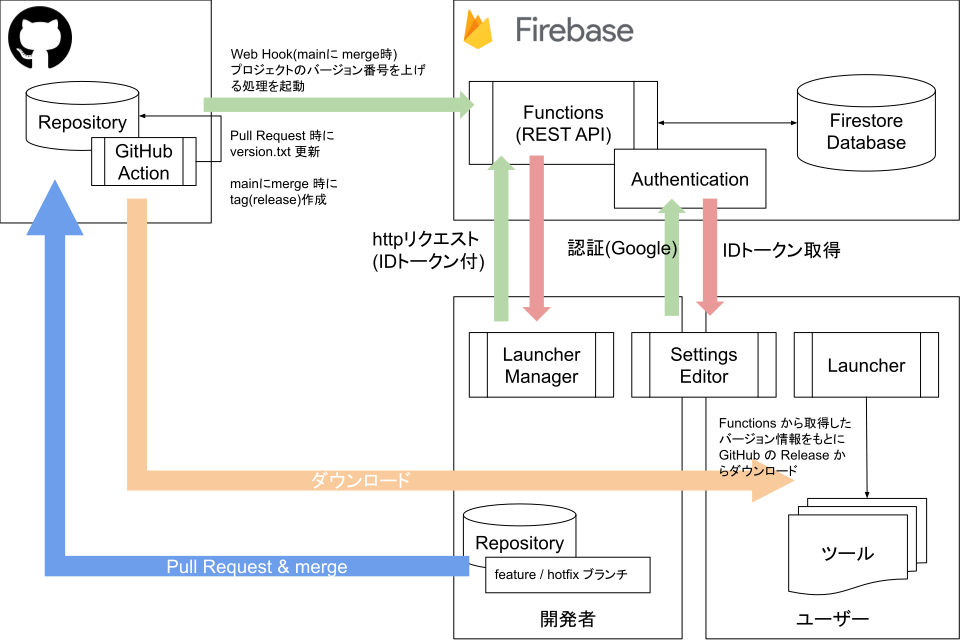

# ランチャー概要

## サーバーは Firebase を利用

フルマネージドサービスのため導入、メンテナンスは比較的簡単

### 料金

https://firebase.google.com/pricing?hl=ja

基本は無料
Functions のみ無料プランでの利用不可  
重量課金プランに移行することで利用可（無料枠はある  
用途、使用頻度的には無料プラン内で収まる想定  

### サーバーはバックエンドのみ

Webサーバーを立てるとテクニカルユニットの人員的にメンテナンスコストが高くなるため REST API のみ構築  
Functions は python で記述可、Firestore は JSON に似た構造のためとっつきやすさはある  
フロント（主に管理画面）は REST API を使用して、スタンドアロンのツールで構築  

### ツール群

#### Launcher（仮）

ランチャー
Firestore に保存されたプロジェクト情報をもとにツール等をダウンロード、起動するアプリ  

#### Launcher Manger（仮）

ランチャーの管理画面  
ユーザー、グループ、プロジェクトの設定を行う  
プロジェクトの割当はグループ単位で行う  
グループは Google Group と連携したい  

#### Settings Editor（仮）

開発者以外の人が触れる設定ファイル  
保存は Firestore へ  
ランチャーでツールと共に所定のフォルダ（環境変数で設定）にダウンロードされる  
ツール側からはダウンロードされたファイルにアクセスする  

### Firebase Functions 

#### データベースの CRUD 関数

Firestore の情報を取得、更新できる関数を http リクエスト経由で呼び出し  

#### GitHub の Web Hook

Github Web Hook 用にも関数を準備  
プロジェクトに登録されているモジュールが更新された際に、プロジェクトのバージョン番号を上げる  
ランチャーはこのバージョン番号を参照して、ツールの更新有無を判断する  

## GitHub のプラン

https://github.co.jp/pricing.html#compare-features

フリープランだとプライベートリポジトリに制限が多いため Team or Enterprise を利用したい  

主に main ブランチの保護  
想定しているフローだと main ブランチへの push は禁止したい  
